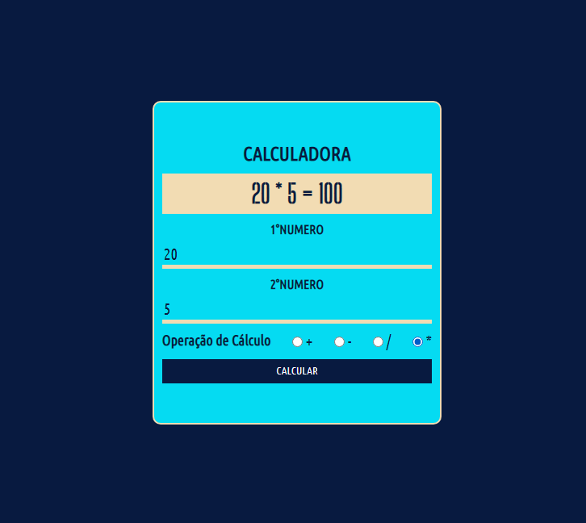

    
    <h1>CALCULADORA EM PHP</h1>

## 📌 ABOUT 

📍 **Calculadora** simples utilizando funções em PHP

## 🚀 TECNOLOGIAS

* **HTML** - Linguagem de Marcação
* **CSS** - Linguagem de Estilo em Cascata
* **PHP** - Linguagem de Programação

## 💻 FUNCIONALIDADE

📍 Os inputs,juntos,recebem 2 números,que serão manipulados de acordo com a opção de cálculo,essa opção é verificada de forma simples e assim os números são aplicados na função de seu respectivo cálculo.

## 🎨 Layout

    

* Colors: 
    * #081A40;
    * #05DBF2;
    * #F2DCB3;

* Fontes:
    * Ubuntu Condense;
    * Big Shoulders Stencil Display;
